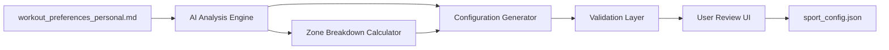

# AI-Powered Preferences to Configuration Workflow

## Overview
This document outlines the workflow for using AI to generate sport configuration from workout_preferences_personal.md, with specific focus on zone breakdown configuration.

## Workflow Architecture



## AI Analysis Components

### 1. Preference Extraction

The AI analyzes the markdown file to extract:

```python
class PreferenceExtractor:
    def extract(self, markdown_content: str) -> Dict:
        return {
            "training_philosophy": self._extract_philosophy(markdown_content),
            "volume_preferences": self._extract_volume(markdown_content),
            "intensity_preferences": self._extract_intensity(markdown_content),
            "sport_specific_notes": self._extract_sport_notes(markdown_content),
            "zone_preferences": self._extract_zone_preferences(markdown_content),
            "equipment": self._extract_equipment(markdown_content),
            "goals": self._extract_goals(markdown_content),
            "constraints": self._extract_constraints(markdown_content)
        }
```

### 2. Philosophy Detection

Key phrases the AI looks for:

```python
PHILOSOPHY_INDICATORS = {
    "polarized": [
        "80/20", "mostly easy", "avoid middle zone", 
        "hard days hard, easy days easy", "polarized training"
    ],
    "pyramidal": [
        "balanced approach", "moderate volume", "pyramidal",
        "progressive intensity", "70/20/10"
    ],
    "threshold": [
        "tempo focused", "threshold training", "sweet spot",
        "sustained efforts", "time at threshold"
    ]
}
```

### 3. Zone Breakdown Customization

The AI can detect custom zone preferences:

```python
def analyze_zone_preferences(content: str) -> Dict[str, float]:
    """
    Extract custom zone breakdown preferences from text.
    
    Examples the AI detects:
    - "I prefer more easy miles, maybe 85% in zone 1"
    - "I like doing more threshold work, 20% in zone 2"
    - "Keep my hard efforts minimal, only 5% in zone 3"
    """
    default = get_philosophy_default(detected_philosophy)
    
    # Look for percentage mentions near zone references
    zone_patterns = {
        "zone1": r"(?:easy|zone 1|recovery).*?(\d+)%",
        "zone2": r"(?:moderate|zone 2|threshold|tempo).*?(\d+)%", 
        "zone3": r"(?:hard|zone 3|interval|vo2).*?(\d+)%"
    }
    
    custom_breakdown = default.copy()
    for zone, pattern in zone_patterns.items():
        match = re.search(pattern, content, re.IGNORECASE)
        if match:
            custom_breakdown[zone] = float(match.group(1))
    
    # Normalize to sum to 100%
    return normalize_breakdown(custom_breakdown)
```

## Configuration Generation

### 1. Sport-Specific Zone Breakdown

The AI can generate different zone breakdowns per sport:

```python
def generate_sport_zone_breakdown(sport: str, preferences: Dict) -> Dict[str, float]:
    """
    Generate sport-specific zone breakdown based on preferences.
    """
    base_breakdown = preferences["zone_preferences"]
    
    # Sport-specific adjustments
    if sport == "Cycling" and "more intervals on bike" in preferences["notes"]:
        # Increase zone 3 for cycling
        return adjust_breakdown(base_breakdown, zone3_increase=5)
    
    elif sport == "Running" and "injury prevention" in preferences["goals"]:
        # More conservative for running
        return adjust_breakdown(base_breakdown, zone1_increase=5)
    
    return base_breakdown
```

### 2. AI Prompt Template

```python
ZONE_CONFIG_PROMPT = """
Analyze the following workout preferences and generate zone breakdown percentages:

Preferences:
{preferences_text}

Current detected philosophy: {philosophy}
Default breakdown: Zone 1: {default_zone1}%, Zone 2: {default_zone2}%, Zone 3: {default_zone3}%

Based on the preferences, should we adjust the zone breakdown? Consider:
1. Any specific percentage mentions
2. Training goals (endurance vs. performance)
3. Injury history or constraints
4. Sport-specific requirements

Respond with JSON:
{
  "recommended_breakdown": {
    "zone1": <percentage>,
    "zone2": <percentage>,
    "zone3": <percentage>
  },
  "reasoning": "<explanation of adjustments>",
  "sport_specific": {
    "Cycling": { "zone1": <percentage>, ... },
    "Running": { "zone1": <percentage>, ... }
  }
}
"""
```

## Implementation Example

### 1. Preference File Example

```markdown
# My Workout Preferences

## Training Philosophy
I follow a polarized approach, trying to keep about 80% of my training easy. I've had some knee issues, so I'm extra careful with running intensity.

## Cycling
- Love doing Peloton Power Zone rides
- Can handle more intensity on the bike
- Maybe 15% of bike time in zone 3

## Running  
- Keep it mostly easy due to past injuries
- Only 5% hard running
- Focus on building aerobic base
```

### 2. AI Analysis Result

```json
{
  "detected_philosophy": "polarized",
  "base_breakdown": {
    "zone1": 80,
    "zone2": 10,
    "zone3": 10
  },
  "custom_breakdown": {
    "Cycling": {
      "zone1": 75,
      "zone2": 10,
      "zone3": 15
    },
    "Running": {
      "zone1": 85,
      "zone2": 10,
      "zone3": 5
    }
  },
  "reasoning": "Adjusted cycling for higher intensity preference (15% zone 3) and running for injury prevention (only 5% zone 3)"
}
```

## User Interface Flow

### 1. Review Screen

```
┌─────────────────────────────────────────────┐
│        AI Configuration Generator           │
├─────────────────────────────────────────────┤
│ Based on your preferences, we recommend:    │
│                                             │
│ Training Philosophy: Polarized ✓            │
│                                             │
│ Zone Breakdown:                             │
│ ┌─────────────┬──────────┬────────────┐   │
│ │    Sport    │  Zone %  │   Custom   │   │
│ ├─────────────┼──────────┼────────────┤   │
│ │   Global    │ 80/10/10 │    [Edit]  │   │
│ │   Cycling   │ 75/10/15 │    [Edit]  │   │
│ │   Running   │ 85/10/5  │    [Edit]  │   │
│ └─────────────┴──────────┴────────────┘   │
│                                             │
│ AI Reasoning:                               │
│ "Adjusted cycling for your preference of   │
│  more intensity work (15% zone 3) and      │
│  running for injury prevention (5% zone 3)" │
│                                             │
│ [Accept] [Modify] [Regenerate] [Cancel]    │
└─────────────────────────────────────────────┘
```

### 2. Edit Dialog

```
┌─────────────────────────────────────────────┐
│        Edit Zone Breakdown - Cycling        │
├─────────────────────────────────────────────┤
│                                             │
│ Zone 1 (Easy):        [75] %               │
│ Zone 2 (Moderate):    [10] %               │
│ Zone 3 (Hard):        [15] %               │
│                       ─────                 │
│ Total:                100 % ✓               │
│                                             │
│ Preset Options:                             │
│ ○ Polarized (80/10/10)                     │
│ ○ Pyramidal (70/20/10)                     │
│ ○ Threshold (50/35/15)                     │
│ ● Custom                                    │
│                                             │
│ [Save] [Cancel] [Reset to AI Suggestion]   │
└─────────────────────────────────────────────┘
```

## Validation Rules

### 1. Zone Breakdown Validation

```python
def validate_zone_breakdown(breakdown: Dict[str, float]) -> Tuple[bool, str]:
    """Validate zone breakdown configuration."""
    
    # Must sum to 100%
    total = sum(breakdown.values())
    if abs(total - 100) > 0.01:
        return False, f"Zone percentages must sum to 100% (currently {total}%)"
    
    # Each zone must be 0-100
    for zone, percentage in breakdown.items():
        if not 0 <= percentage <= 100:
            return False, f"{zone} percentage must be between 0-100%"
    
    # Logical checks
    if breakdown["zone1"] < 40:
        return False, "Zone 1 should typically be at least 40% for health"
    
    if breakdown["zone3"] > 30:
        return False, "Zone 3 above 30% may lead to overtraining"
    
    return True, "Valid zone breakdown"
```

### 2. Sport-Specific Validation

```python
def validate_sport_breakdown(sport: str, breakdown: Dict) -> Tuple[bool, str]:
    """Sport-specific zone breakdown validation."""
    
    if sport == "Running" and breakdown["zone3"] > 20:
        return False, "Running typically requires less high intensity due to impact"
    
    if sport == "Swimming" and breakdown["zone2"] < 15:
        return False, "Swimming benefits from more threshold work"
    
    return True, "Valid for " + sport
```

## Integration Points

### 1. API Endpoints

```python
# Generate configuration from preferences
POST /api/config/generate-from-preferences
{
  "preferences_content": "markdown content...",
  "use_ai": true,
  "sports": ["Cycling", "Running"]
}

# Validate zone breakdown
POST /api/config/validate-zone-breakdown
{
  "sport": "Cycling",
  "breakdown": {"zone1": 75, "zone2": 10, "zone3": 15}
}

# Save configuration
POST /api/config/save
{
  "config": { /* full sport config */ }
}
```

### 2. Service Integration

```python
class AIConfigGenerator:
    def __init__(self, ai_service, config_service):
        self.ai = ai_service
        self.config = config_service
    
    async def generate_from_preferences(self, preferences_path: str):
        # Read preferences
        content = read_file(preferences_path)
        
        # AI analysis
        analysis = await self.ai.analyze_preferences(content)
        
        # Generate config
        config = self.build_config(analysis)
        
        # Validate
        validation = self.config.validate(config)
        
        return {
            "config": config,
            "analysis": analysis,
            "validation": validation
        }
```

## Error Handling

### Common Issues

1. **Invalid Preferences Format**
   - Provide template/example
   - Highlight parsing errors
   - Suggest fixes

2. **Conflicting Preferences**
   - Show conflicts to user
   - Provide AI reasoning
   - Allow manual resolution

3. **Invalid Zone Breakdowns**
   - Show validation errors
   - Suggest valid alternatives
   - Provide presets

## Future Enhancements

1. **Learning System**
   - Track user adjustments
   - Improve AI suggestions over time
   - Personalized defaults

2. **Advanced Analysis**
   - Historical training data integration
   - Performance-based adjustments
   - Injury risk assessment

3. **Multi-User Support**
   - Coach/athlete workflows
   - Team configurations
   - Shared templates

## Conclusion

This AI-powered workflow transforms unstructured preferences into validated, sport-specific zone breakdown configurations while maintaining user control and system compatibility.